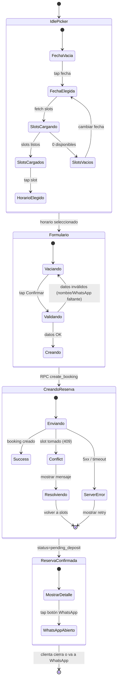

# UC-002: Reservar turno — State Diagram

```mermaid
stateDiagram-v2
    [*] --> IdlePicker
    state IdlePicker {
        [*] --> FechaVacia
        FechaVacia --> FechaElegida: tap fecha
        FechaElegida --> SlotsCargando: fetch slots
        SlotsCargando --> SlotsCargados: slots listos
        SlotsCargando --> SlotsVacios: 0 disponibles
        SlotsVacios --> FechaElegida: cambiar fecha
        SlotsCargados --> HorarioElegido: tap slot
    }

    IdlePicker --> Formulario: horario seleccionado
    state Formulario {
        [*] --> Vaciando
        Vaciando --> Validando: tap Confirmar
        Validando --> Vaciando: datos inválidos (nombre/WhatsApp faltante)
        Validando --> Creando: datos OK
    }

    Formulario --> CreandoReserva: RPC create_booking
    state CreandoReserva {
        [*] --> Enviando
        Enviando --> Success: booking creado
        Enviando --> Conflict: slot tomado (409)
        Enviando --> ServerError: 5xx / timeout
        Conflict --> Resolviendo: mostrar mensaje
        Resolviendo --> [*]: volver a slots
        ServerError --> [*]: mostrar retry
    }

    CreandoReserva --> ReservaConfirmada: status=pending_deposit
    state ReservaConfirmada {
        [*] --> MostrarDetalle
        MostrarDetalle --> WhatsAppAbierto: tap botón WhatsApp
    }

    ReservaConfirmada --> [*]: clienta cierra o va a WhatsApp
```
